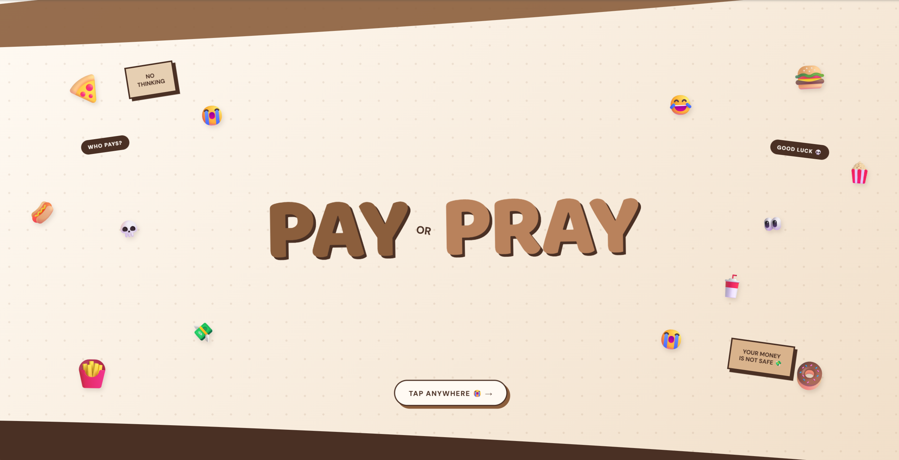
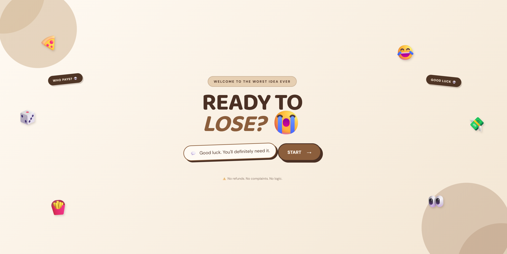
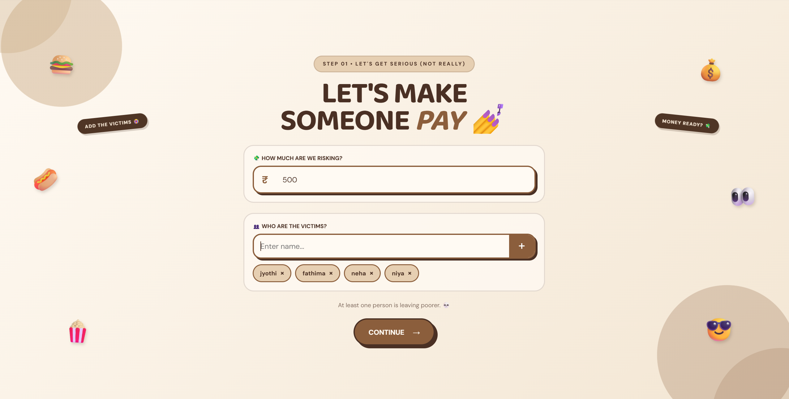
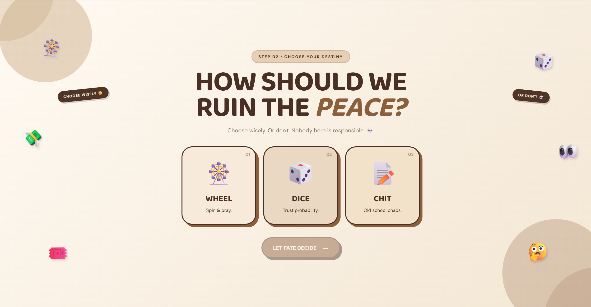
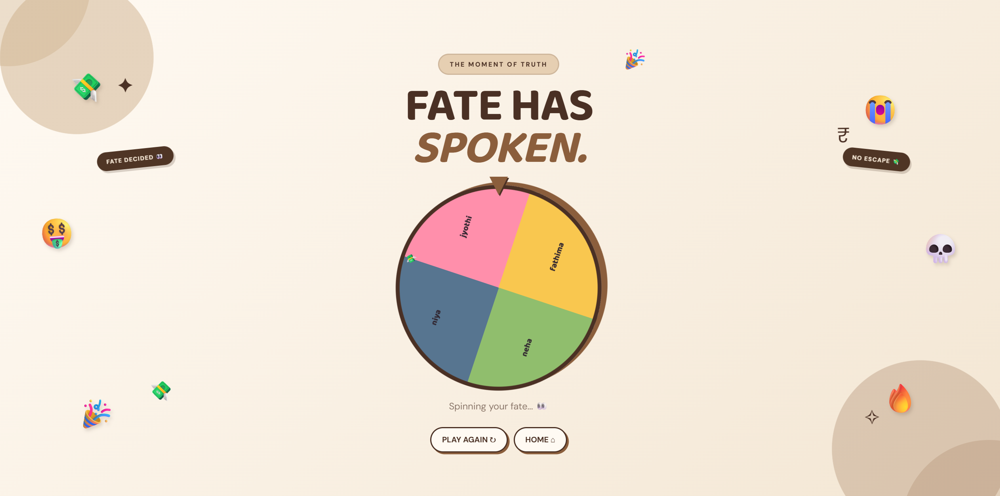
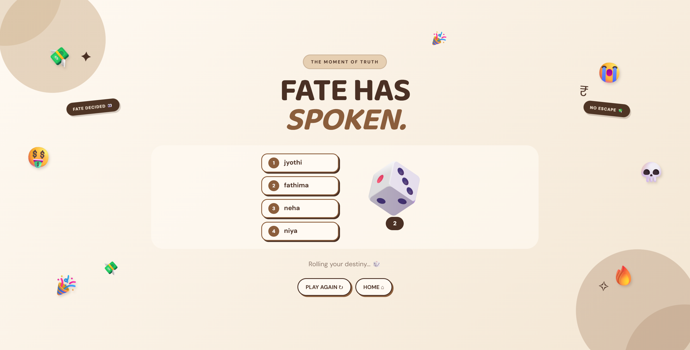
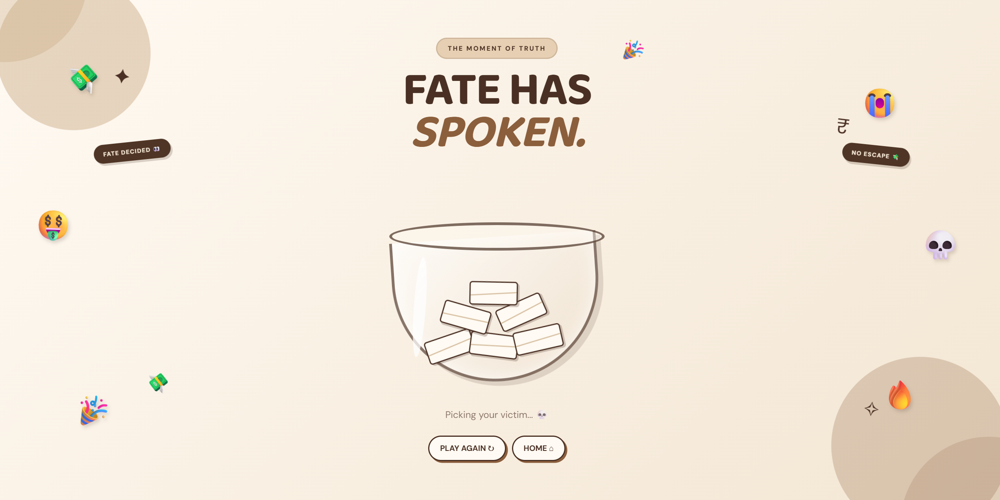
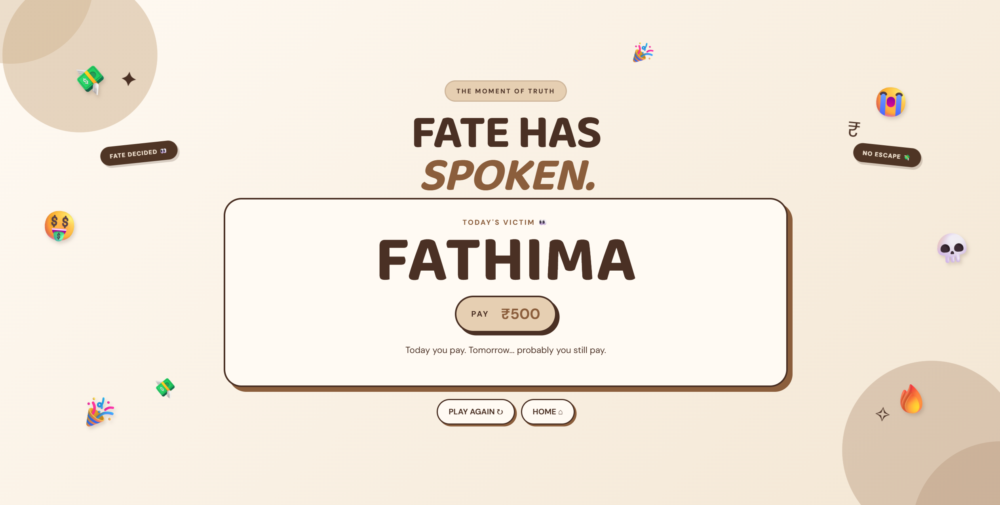

# Pay or Pray🎯


## Basic Details
### Team Name: Jyothika Fathima


### Team Members
- Team Lead:Fathima.T.A - Jain University
- Member 2: Jyothika.K-Jain University

## Project Description

**Pay or Pray** is a fun decision-making web application designed to randomly choose who has to pay the bill. Users can add participants, enter an amount, and let fate decide using a Wheel, Dice, or Chit method.

It turns the stressful question **"Who Pays?"** into a fun and entertaining experience! 💸😂

## The Problem (that doesn't exist)

The biggest problem after eating with friends is always:

**"Who is going to pay the bill?"** 😭

Everyone suddenly becomes silent, checks their phone, or pretends they forgot their wallet. Pay or Pray solves this extremely serious and totally unnecessary problem! 💀

## The Solution (that nobody asked for)

Add everyone's names, enter the bill amount, choose your favorite method, and let **fate** select the unlucky person! 🎲💸

No arguments. No excuses. No escaping.

**Pay... or Pray! 😌🙏**

# Technical Details

## Technologies/Components Used

### For Software:

- **Languages used:** HTML, CSS, JavaScript, Python
- **Frameworks used:** Flask
- **Libraries used:** Flask
- **Tools used:** Visual Studio Code, GitHub, Web Browser

### For Hardware:

- Computer/Laptop
- Internet Connection
- Keyboard and Mouse

# Implementation

## For Software:

### Installation

```bash
pip install flask

# Run
python app.py
'''

# Screenshots

### 1. Home Page


*Welcome screen*

### 2. Introduction Page


*Game introduction*

### 3. Setup Page


*Add participants*

### 4. Method Selection


*Choose your fate*

### 5. Wheel Game


*Spin and select*

### 6. Dice Game


*Roll for payer*

### 7. Chit Game


*Pick random payer*

### 8. Final Result


*Selected person pays*

# Diagrams
![Workflow]
User enters the amount and participant names  
↓  
User selects a method (Wheel / Dice / Chit)  
↓  
The selected game method randomly chooses a participant  
↓  
The result is displayed  
↓  
The selected person pays the bill

### Project Demo
# Video

https://github.com/Jyothika23-del/pay_or_pray/blob/main/video2.mp4

# Additional Demos
[Add any extra demo materials/links]

## Team Contributions

- Jyothika: Frontend design, UI development, CSS styling, and project documentation.
- Fathima: Backend development, JavaScript functionality, and game logic.

---
Made with ❤️ at TinkerHub Useless Projects 


